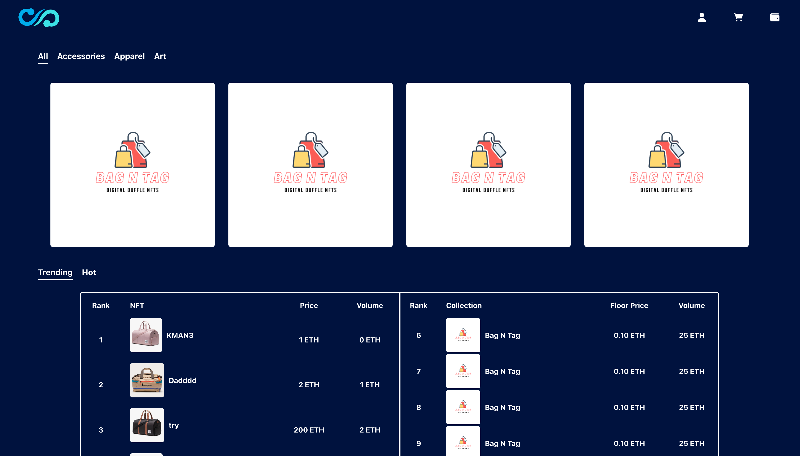
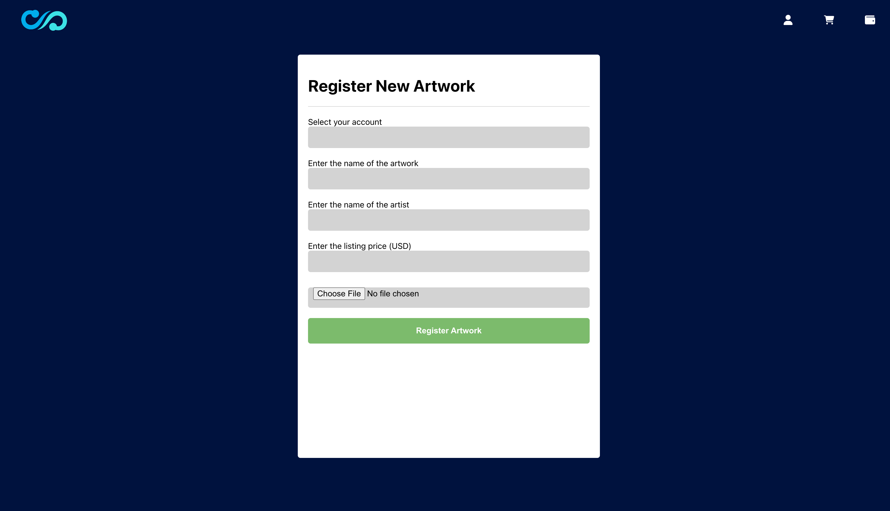
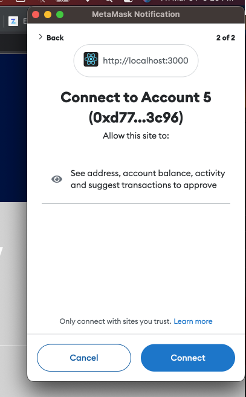
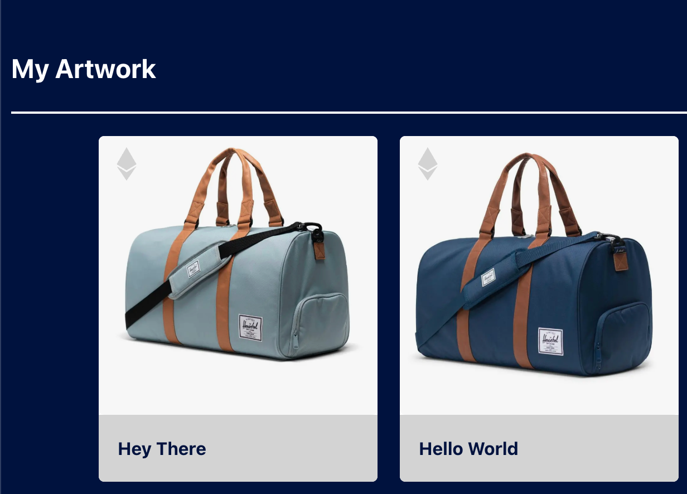
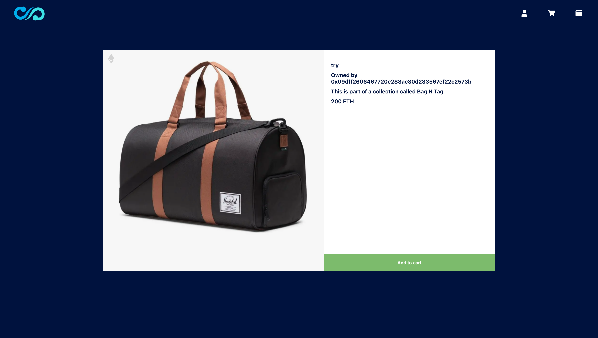
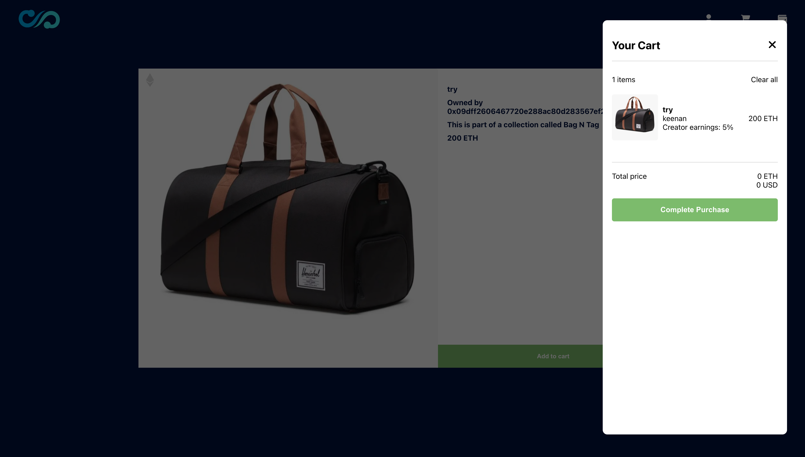
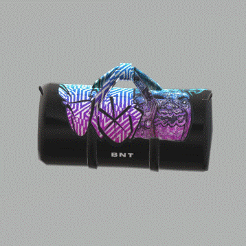
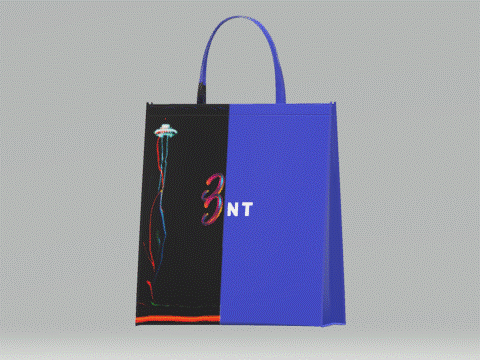

# StuffSwap


---

## Description

We created a mock online marketplace for [NFT's (Non-Fungible Tokens)](https://en.wikipedia.org/wiki/Non-fungible_token). The site allows a user to register new NFT's and buy other users' NFT's. This project was created on the Ethereum blockchain and users ether for transactions, utitizing [MetaMask](https://metamask.io/download/) to facilitate transactions. One of our team members, Audell Sabeti, created an NFT collection that is available on the site. The website will allow users to browse and purchase NFTs from the collection using cryptocurrency, such as Ethereum, as a payment method. The UI was created using React.js framework. For data storage, we used [Pinata](https://www.pinata.cloud/), our smart contract was written in [Solidity](https://soliditylang.org/) and we used [Ganache](https://trufflesuite.com/ganache/) for our local blockchain configuration.

When the user has installed all packages and setup the `.env` file or has navigated to the [deployed site](https://stuff-swap.herokuapp.com/), they should see our front page.


As we can see, the user can choose different NFT's to view either from the top carousel or the bottom table showing the hottest NFT's on the site. Additionally, the user can click the "user" icon and is presented with five options:
  + My Art
  + Register New Art
  + Update Existing Art (price)
  + Sell Art
  + Settings (not yet available)

For example, if the user wanted to register their art and clicked that link, they would be brought to the following screen:

If this this the first time the user has visited the site, [MetaMask](https://metamask.io/download/) will prompt the user asking for it to connect the site to the wallet.


Once the user is connected, fills out the form and clicks `Register Artwork`, [MetaMask](https://metamask.io/download/) will prompt the user to confirm the transaction. Once the transaction has been sent and the results verified, the user can naviage to their art through the `user` button in the header. They will see something like this:


When the art has been uploaded and a price has been set, all other users on the site will be able to see their art and be able to purchase the art for the price set by the current owner.
image here

If a user an NFT on the site, they can click on it which will bring them to a page of the NFT and its details.


When the user clicks `Add to Cart`, the selected NFT will now be in their cart. The user can then click the cart icon in the header and it will bring them to a screen that looks like this:


The user can then complete the purchase by clicking `Complete Purchase`. MetaMask will prompt the user to confirm the transaction. Once selected and if the transaction is successful, when the user naviages back to the `My Art` page, they will see the art they have just purchased!

A gif below shows the process of registering art and finding it in the `My Art` tab.


Check out the skills from [Audell Sabeti](https://www.linkedin.com/in/audell-sabeti-38375a1b2)! Here are a couple of the NFT's he created. You can find more in the `media/bags/` directory.




---

## Table of Contents

- [StuffSwap](#stuffswap)
  - [Description](#description)
  - [Table of Contents](#table-of-contents)
  - [1. Installation](#1-installation)
  - [2. Usage](#2-usage)
  - [3. License](#3-license)
  - [4. Contributing](#4-contributing)
  - [5. Tests](#5-tests)
  - [6. Deployment](#6-deployment)
  - [7. Contact](#7-contact)

---

## 1. Installation

  If you would like to clone the repository, type `git clone https://github.com/kheller18/stuff-swap.git`.
  In the terminal, with the [Node.js](https://nodejs.org/en) installed, navigate to the root directory and type `npm install`. This will install all packages needed to run the web app that are specified in the two `package.json` files. Next, in the root directory of the `client` folder, create a new file named `.env`.

  Next, we must ensure that `Pinata`, `Ganache`, `MetaMask`, `abi` and `.env` are correctly configured.
  + `Pinata`
    + Create a Pinata account. Naviage to the page "API Keys". Keep those keys handy for configuration in the `.env` file.
  + `Ganache`
    + Open the Ganache desktop app and quickstart a new ethereum blockchain.
  + `MetaMask`
    + Using info Ganache, set up a development network by doing the following (if you haven't already)
      + Click "Add Network"
      + Click "Add a network manually"
      + Add a name for you network
      + Add the RPC URL (found in Ganache)
      + Type "1337" for Chain ID
      + Type "ETH" for currency symbol
      + Click "Save"
    + Now, import accounts from Ganache into MetaMask using private keys
      + Copy private key from Ganache
      + Click "Import Account" in MetaMask
      + Paste the private key
      + Click "Import"
  + `abi`
    + Upload the file in the `client/src/contracts/StuffSwap.sol` into the [Remix IDE](https://remix.ethereum.org/#lang=en&optimize=false&runs=200&evmVersion=null).
    + Click "Compile"
    + Once compiled, copy the abi file and navigate to the `client/src/contracts/compiled/stuffswapABI.json` file and paste the abi code into that file.
    + Navigate back to the [Remix IDE](https://remix.ethereum.org/#lang=en&optimize=false&runs=200&evmVersion=null) and deploy the contract. Copy the deployment address and navigate to your `.env` file.
  + `.env`
    + With your file open set up the following four variables
      + `REACT_APP_PINATA_API_KEY = '<Found in Pinata API Keys>'`
      + `REACT_APP_PINATA_API_SECRET = '<Found in Pinata API Keys>'`
      + `REACT_APP_WEB3_PROVIDER_URI = <URI found in Ganache>`
      + `REACT_APP_SMART_CONTRACT_ADDRESS = '<Address copied from Remix>'`
    + Once all of these are set up, you are ready to run the app!
    + Please to the [Usage](#2-usage) section for next steps.


---

## 2. Usage

To use the app, and once all steps are completed in the [Installation](#1-installation) section, simply type `npm run start` in the root directory. This should open your web browser to the site. Play around from here and start uploading NFT's!


---

## 3. License
  ```
  MIT License

  Copyright (c) 2023 Keenan Heller | Olga Ortega | Audell Sabeti | Ariana Moreno | Rachel Hodson

  Permission is hereby granted, free of charge, to any person obtaining a copy
  of this software and associated documentation files (the "Software"), to deal
  in the Software without restriction, including without limitation the rights
  to use, copy, modify, merge, publish, distribute, sublicense, and/or sell
  copies of the Software, and to permit persons to whom the Software is
  furnished to do so, subject to the following conditions:

  The above copyright notice and this permission notice shall be included in all
  copies or substantial portions of the Software.

  THE SOFTWARE IS PROVIDED "AS IS", WITHOUT WARRANTY OF ANY KIND, EXPRESS OR
  IMPLIED, INCLUDING BUT NOT LIMITED TO THE WARRANTIES OF MERCHANTABILITY,
  FITNESS FOR A PARTICULAR PURPOSE AND NONINFRINGEMENT. IN NO EVENT SHALL THE
  AUTHORS OR COPYRIGHT HOLDERS BE LIABLE FOR ANY CLAIM, DAMAGES OR OTHER
  LIABILITY, WHETHER IN AN ACTION OF CONTRACT, TORT OR OTHERWISE, ARISING FROM,
  OUT OF OR IN CONNECTION WITH THE SOFTWARE OR THE USE OR OTHER DEALINGS IN THE
  SOFTWARE.
  ```
---

## 4. Contributing

  + [Keenan Heller](https://github.com/kheller18)
  + [Rachel Hodson](https://github.com/rachelannhodson)
  + [Ariana Moreno](https://github.com/arianamoreno13)
  + [Olga Ortega](https://github.com/olgaortega5)
  + [Audell Sabeti](https://github.com/asabeti)

---

## 5. Tests

  + Testing of this contract can be done through the [Remix IDE](https://remix.ethereum.org/#lang=en&optimize=false&runs=200&evmVersion=null&version=soljson-v0.8.18+commit.87f61d96.js) once the user has deployed the contract locally.

---

## 6. Deployment
  + There is currently live deployment of the front end. The user can also deploy the application locally to be able to use full functionality of the site. Both methods are described below.
    + [Front End](https://stuff-swap.herokuapp.com/)
    + Local Deployment:
      + Refer to the [Installation](#1-installation) and [Usage](#2-usage) sections of this document.


---

## 7. Contact

  + [Keenan's LinkedIn](https://www.linkedin.com/in/keenanheller/)
  + [Rachel's LinkedIn](https://www.linkedin.com/in/rachelannhodson/)
  + [Ariana's LinkedIn](www.linkedin.com/in/ariana-moreno-52b2b7211)
  + [Olga's LinkedIn](https://www.linkedin.com/in/olga-ortega-82a15329)
  + [Audell's LinkedIn](https://www.linkedin.com/in/audell-sabeti-38375a1b2)

---
